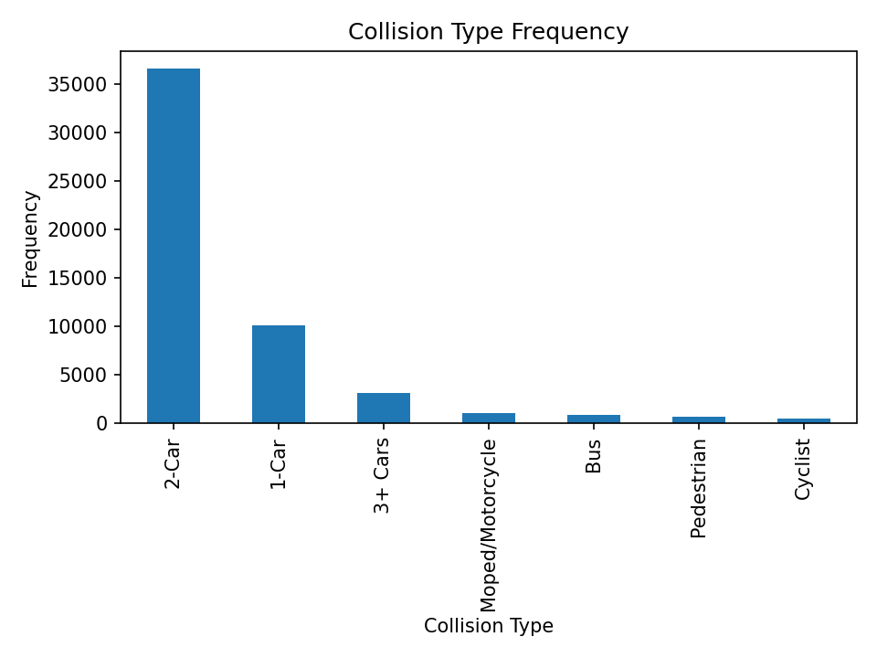
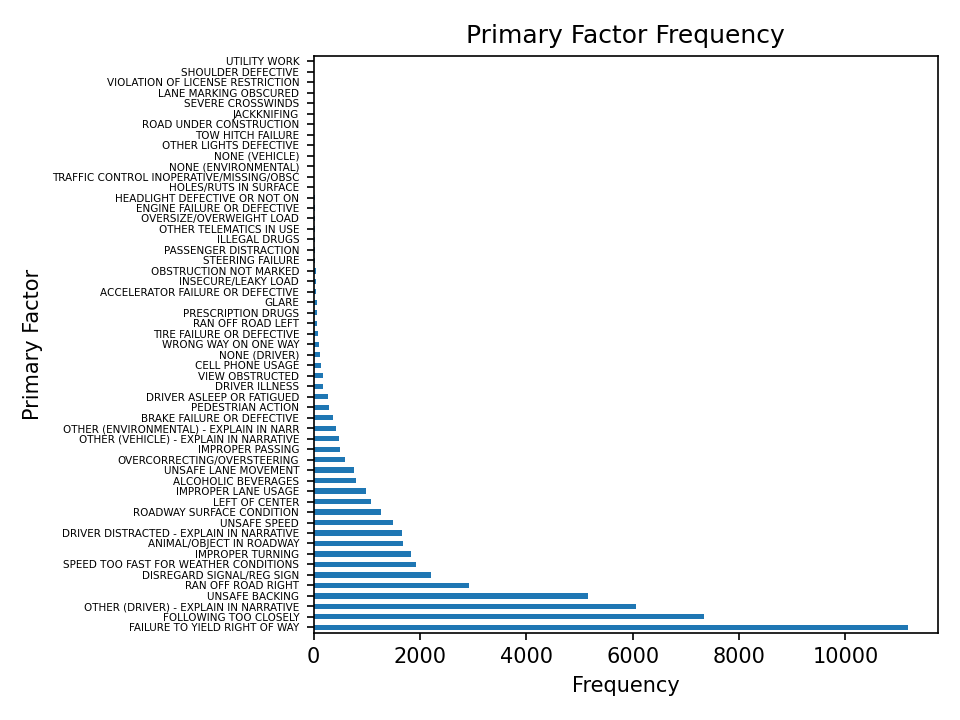
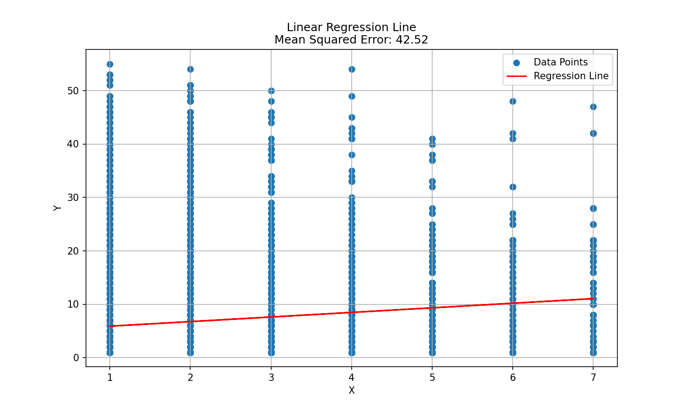
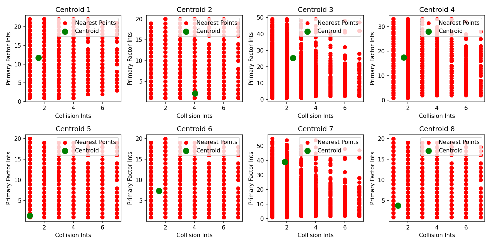
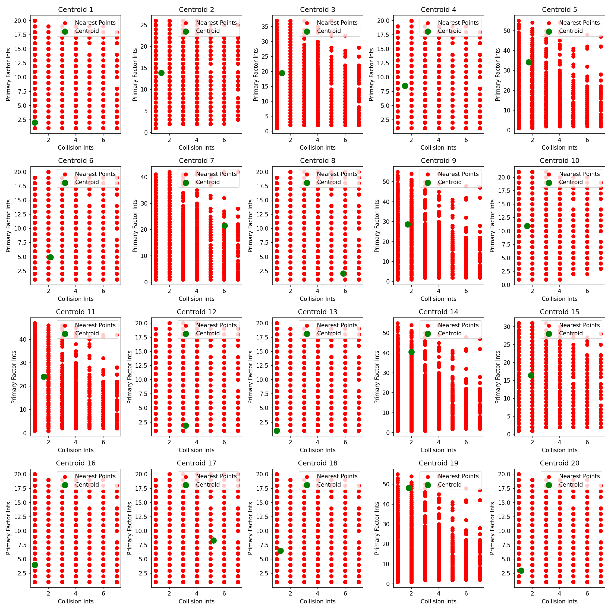

# Car Crash Data Clustering & Regression Analysis

Statistics final project analyzing a real-world traffic collision dataset using linear regression and K-Means clustering to explore relationships between collision type and primary contributing factor.

## Overview

Traffic collision records don't come with an obvious numeric structure, most of the useful fields (collision type, primary contributing factor) are categorical. This project encodes those categories numerically, fits a baseline linear regression across the full dataset, then uses K-Means clustering to segment the data and re-fits regression within each cluster to see whether clustering reveals stronger local relationships that a single global model misses.

## What it does

1. **Data cleaning** — loads the crash dataset, drops incomplete records.
2. **Exploratory analysis** — plots frequency distributions of collision type and primary contributing factor to understand the category breakdown before modeling.
3. **Feature encoding** — maps each categorical field (collision type, primary factor) to a numeric value ranked by frequency, so the fields can be used in regression and clustering.
4. **Baseline regression** — fits a single linear regression across the full dataset to test the overall relationship between collision type and primary factor, using mean squared error (MSE) as the fit metric.
5. **K-Means clustering** — clusters records by collision type and primary factor, tested at two granularities (k=8 and k=20), and visualizes each cluster's centroid against its nearest points.
6. **Per-cluster regression** — re-fits linear regression within each individual cluster and compares MSE across clusters against the baseline, to evaluate whether segmenting the data first produces a better local fit than one model for the whole dataset.

## Output

- Bar charts showing the frequency of each collision type and primary contributing factor.
- A baseline regression line and MSE for collision type vs. primary factor across the full dataset.
- Cluster visualizations (at k=8 and k=20) showing each cluster's centroid and its nearest points.
- Regression slope, intercept, and MSE for each individual cluster, allowing direct comparison of model fit across clusters vs. the single baseline model.

## Tech stack

Python, pandas, NumPy, scikit-learn (`KMeans`, `LinearRegression`), Matplotlib

## Notes

Originally built and run in Google Colab as a course final project; this repo contains the exported script version.

## Results

Analysis of 52,582 cleaned crash records.

**Collision Type is dominated by 2-car crashes.** 2-Car (36,542), 1-Car (10,032), 3+ Cars (3,106), Moped/Motorcycle (999), Bus (841), Pedestrian (599), Cyclist (463).

**Primary Factor is long-tailed.** Top causes: Failure to Yield Right of Way (11,175), Following Too Closely (7,345), "Other (Driver)" (6,070), and Unsafe Backing (5,166), followed by a long tail of less frequent causes (weather, signal disregard, improper turning, etc.).

**The baseline regression of Collision Type vs. Primary Factor is weak.** Both variables were label-encoded by frequency rank and fit with a simple linear regression: slope ≈ 0.86, intercept ≈ 5.03. The scatter is essentially a grid of integer categories with no real linear trend — a poor fit, as expected, since neither variable is actually ordinal/continuous.

**K-means clustering produces much tighter local fits than the global regression.** Re-fitting a regression within each cluster consistently gives far lower mean squared error than the single global model:
- With **k=8**, per-cluster MSE ranged from ~0.24 to ~26.1, with most clusters well under 2.
- With **k=20**, per-cluster MSE dropped further, with several clusters at MSE = 0 (a single repeated category pairing) and most others under 3.

This is a methodological cautionary result, not evidence of a real underlying relationship: label-encoding nominal categories and running linear regression/K-means on the resulting integers can produce misleadingly good local fits, since cluster boundaries just isolate small groups of matching category codes.

**Figures**

1. Collision Type frequency
   
2. Primary Factor frequency
   
3. Baseline regression: Collision Type vs. Primary Factor (encoded)
   
4. K-means clustering, k=8, with per-cluster nearest points and centroids
   
5. K-means clustering, k=20, with per-cluster nearest points and centroids
   
